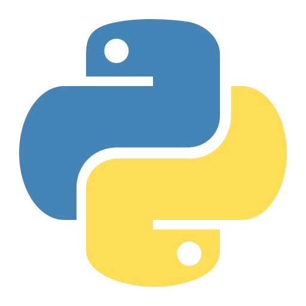

# Hello There!👋
 I am preparing this solutions repo for helping others when they are trying to find the solution of their problems.
 I will push every solution that I can found as much as possible in languages as much as possible.
 I mainly use JavaScript and C but I also can code in Phyton, Java and Kotlin, too. Therefore, I am gonna try to put solutions in every language I have listed under here as much as possible.
# Languages That I Will Use In My Solutions
- JavaScript 
- C 
- Python 
- Kotlin 
- Java 

# Solutions📝

    
December 2023

        <table>
            <tr>
                <th>Day</th>
                <th>Solutions</th>
            </tr>
            <tr>
                <td>Day 3</td>
                <td><a href="./December%202023/Day3">Solutions</a></td>
            </tr>
        </table>

